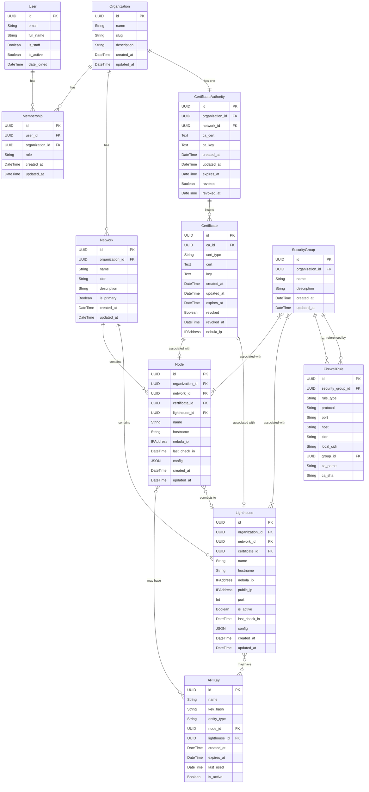

# Database Schema

This document provides an overview of the database schema used in Simple Nebula.

## Entity Relationship Diagram

## Model Descriptions

### User

The User model represents the users of the application. Users can be members of multiple organizations with different roles.

| Field | Type | Description |
|-------|------|-------------|
| `id` | UUID | Primary key |
| `email` | String | User's email address (unique) |
| `full_name` | String | User's full name |
| `is_staff` | Boolean | Whether the user can access the admin site |
| `is_active` | Boolean | Whether the user account is active |
| `date_joined` | DateTime | When the user joined |

### Organization

Organizations are the top-level containers that group related resources such as networks, nodes, etc.

| Field | Type | Description |
|-------|------|-------------|
| `id` | UUID | Primary key |
| `name` | String | Organization name |
| `slug` | String | URL-friendly identifier |
| `description` | Text | Organization description |
| `created_at` | DateTime | Creation timestamp |
| `updated_at` | DateTime | Last update timestamp |

### Membership

The Membership model represents the many-to-many relationship between users and organizations, with role information.

| Field | Type | Description |
|-------|------|-------------|
| `id` | UUID | Primary key |
| `user_id` | UUID | Foreign key to User |
| `organization_id` | UUID | Foreign key to Organization |
| `role` | String | Role in the organization (admin, operator, viewer) |
| `created_at` | DateTime | Creation timestamp |
| `updated_at` | DateTime | Last update timestamp |

### Network

Networks define IP address spaces using CIDR notation.

| Field | Type | Description |
|-------|------|-------------|
| `id` | UUID | Primary key |
| `organization_id` | UUID | Foreign key to Organization |
| `name` | String | Network name |
| `cidr` | String | CIDR notation (e.g., 10.0.0.0/16) |
| `description` | Text | Network description |
| `is_primary` | Boolean | Whether this is the primary network |
| `created_at` | DateTime | Creation timestamp |
| `updated_at` | DateTime | Last update timestamp |

### CertificateAuthority

Each organization has a certificate authority (CA) for issuing certificates to nodes and lighthouses.

| Field | Type | Description |
|-------|------|-------------|
| `id` | UUID | Primary key |
| `organization_id` | UUID | Foreign key to Organization |
| `network_id` | UUID | Foreign key to Network |
| `ca_cert` | Text | CA certificate |
| `ca_key` | Text | CA private key |
| `created_at` | DateTime | Creation timestamp |
| `updated_at` | DateTime | Last update timestamp |
| `expires_at` | DateTime | Expiration timestamp |
| `revoked` | Boolean | Whether the CA is revoked |
| `revoked_at` | DateTime | Revocation timestamp |

### Certificate

Certificates are issued by the CA for nodes and lighthouses.

| Field | Type | Description |
|-------|------|-------------|
| `id` | UUID | Primary key |
| `ca_id` | UUID | Foreign key to CertificateAuthority |
| `cert_type` | String | Type of certificate (node, lighthouse) |
| `cert` | Text | Certificate |
| `key` | Text | Private key |
| `created_at` | DateTime | Creation timestamp |
| `updated_at` | DateTime | Last update timestamp |
| `expires_at` | DateTime | Expiration timestamp |
| `revoked` | Boolean | Whether the certificate is revoked |
| `revoked_at` | DateTime | Revocation timestamp |
| `nebula_ip` | IPAddress | Nebula IP address |

### SecurityGroup

Security groups define firewall rules that can be applied to nodes and lighthouses.

| Field | Type | Description |
|-------|------|-------------|
| `id` | UUID | Primary key |
| `organization_id` | UUID | Foreign key to Organization |
| `name` | String | Security group name |
| `description` | Text | Security group description |
| `created_at` | DateTime | Creation timestamp |
| `updated_at` | DateTime | Last update timestamp |

### FirewallRule

Firewall rules define access control for security groups.

| Field | Type | Description |
|-------|------|-------------|
| `id` | UUID | Primary key |
| `security_group_id` | UUID | Foreign key to SecurityGroup |
| `rule_type` | String | Type of rule (inbound, outbound) |
| `protocol` | String | Protocol (tcp, udp, icmp, any) |
| `port` | String | Port or port range |
| `host` | String | Host name |
| `cidr` | String | CIDR notation for source/destination |
| `local_cidr` | String | Local CIDR notation |
| `group_id` | UUID | Foreign key to referenced SecurityGroup |
| `ca_name` | String | CA name for verification |
| `ca_sha` | String | CA SHA for verification |

### Node

Nodes are devices in the Nebula mesh network.

| Field | Type | Description |
|-------|------|-------------|
| `id` | UUID | Primary key |
| `organization_id` | UUID | Foreign key to Organization |
| `network_id` | UUID | Foreign key to Network |
| `certificate_id` | UUID | Foreign key to Certificate |
| `lighthouse_id` | UUID | Foreign key to Lighthouse |
| `name` | String | Node name |
| `hostname` | String | Node hostname |
| `nebula_ip` | IPAddress | Nebula IP address |
| `last_check_in` | DateTime | Last check-in timestamp |
| `config` | JSON | Configuration data |
| `created_at` | DateTime | Creation timestamp |
| `updated_at` | DateTime | Last update timestamp |

### Lighthouse

Lighthouses are special nodes that help with NAT traversal and node discovery.

| Field | Type | Description |
|-------|------|-------------|
| `id` | UUID | Primary key |
| `organization_id` | UUID | Foreign key to Organization |
| `network_id` | UUID | Foreign key to Network |
| `certificate_id` | UUID | Foreign key to Certificate |
| `name` | String | Lighthouse name |
| `hostname` | String | Lighthouse hostname |
| `nebula_ip` | IPAddress | Nebula IP address |
| `public_ip` | IPAddress | Public IP address |
| `port` | Integer | Port number (default: 4242) |
| `is_active` | Boolean | Whether the lighthouse is active |
| `last_check_in` | DateTime | Last check-in timestamp |
| `config` | JSON | Configuration data |
| `created_at` | DateTime | Creation timestamp |
| `updated_at` | DateTime | Last update timestamp |

### APIKey

API keys allow automated authentication for nodes and lighthouses.

| Field | Type | Description |
|-------|------|-------------|
| `id` | UUID | Primary key |
| `name` | String | API key name |
| `key_hash` | String | Hashed API key |
| `entity_type` | String | Type of entity (node, lighthouse) |
| `node_id` | UUID | Foreign key to Node |
| `lighthouse_id` | UUID | Foreign key to Lighthouse |
| `created_at` | DateTime | Creation timestamp |
| `expires_at` | DateTime | Expiration timestamp |
| `last_used` | DateTime | Last usage timestamp |
| `is_active` | Boolean | Whether the API key is active | 